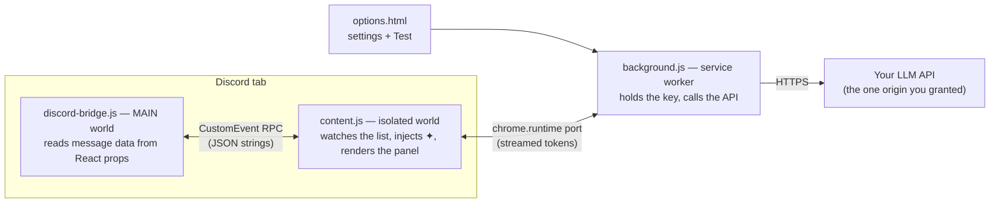
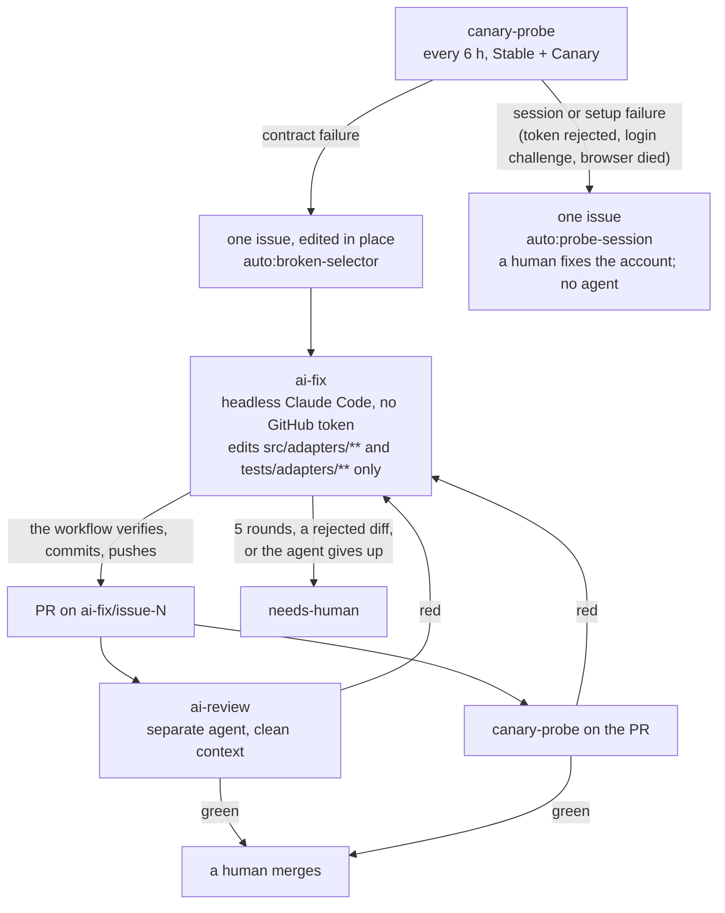

<h1 align="center">Kibitz</h1>

<p align="center">
  <strong>Ask an AI about any Discord message, right next to it.</strong><br/>
  A Chrome extension. Bring your own API key. No server, no account, no telemetry.
</p>

<p align="center">
  <a href="https://github.com/534552454653495A/kibitz/actions/workflows/ci.yml"></a>
</p>

> *kibitzer* (n.) — someone who looks over your shoulder and comments.

Kibitz puts a small **✦** after every message in Discord's web app. Click it and a panel
opens with an explanation of that message: slang, references, tone, who it replies to,
what the attachments are. Ask follow-ups. Press **Scan related messages** and Kibitz
scrolls back through the channel, collects the surrounding conversation and summarises
what was asked, what was decided and what is still open.

| | |
| --- | --- |
| **Works on** | `discord.com`, `canary.discord.com`, `ptb.discord.com` in the browser: server channels and DMs. Not the Discord desktop app. |
| **Needs** | Chrome 120+ (other Chromium browsers should work; only Chrome is tested) · Node 22+ to build · an API key for an OpenAI-compatible endpoint or Anthropic |
| **Install** | From source only. No Web Store listing, no release download, no icon yet (Chrome shows a default one). |
| **Status** | `0.1.0`, pre-release. Run by hand on Discord Stable once. See [Project status](#project-status). |
| **Next** | YouTube, then Instagram/Facebook. X/Twitter is not planned. |

**Contents:** [Know before you install](#know-before-you-install) ·
[Quick start](#quick-start) · [Providers](#providers) · [Using Kibitz](#using-kibitz) ·
[Troubleshooting](#troubleshooting) · [Where your data goes](#where-your-data-goes) ·
[Project status](#project-status) · [How it works](#how-it-works) ·
[When Discord changes](#when-discord-changes) · [Development](#development) ·
[License](#license)

## Know before you install

- **Discord's Terms of Service prohibit client modifications.** Kibitz injects code into
  the Discord web app. Discord has not been known to ban users for read-only UI
  extensions, but that is Discord's choice, not a guarantee. Do not use it on an account
  you cannot afford to lose. Kibitz is not affiliated with Discord or any AI vendor.
- **Your messages go to your AI provider.** When you click ✦, that message (and, if you
  scan, the surrounding messages) goes from your browser straight to the API you
  configured. Nothing is sent anywhere else. Read your provider's data policy.
- **Your API key is your money.** It is stored in `chrome.storage.local` on this machine
  only, read by the extension's background worker and its settings page, and never
  visible to the code that runs inside the Discord tab. Details in
  [Where your data goes](#where-your-data-goes).

## Quick start

```bash
git clone https://github.com/534552454653495A/kibitz.git
cd kibitz
npm ci
npm run build          # → dist/
```

1. Open `chrome://extensions`, turn on **Developer mode**, click **Load unpacked** and pick
   the `dist/` folder.
2. Open the settings page: the puzzle-piece **Extensions** menu → **Kibitz** (pin it if
   you like), or `chrome://extensions` → Kibitz → **Details** → **Extension options**.
   Pick a provider, paste your key, press **Save**. Chrome asks you to allow access to
   **one origin**, the API you typed. Allow it.
3. Press **Test**. It sends "Reply with the single word OK." through the real pipeline
   and prints the answer. Test uses the *saved* settings, so Save first.
4. Open a Discord channel (reload it if it was already open). Every message now ends
   with a ✦.

**Update:** `git pull && npm run build`, then reload the extension in `chrome://extensions`
and the Discord tab. **Remove:** delete it in `chrome://extensions`; that also deletes the
stored settings and the origin grant.

## Providers

Kibitz speaks two wire formats. Picking a provider pre-fills a base URL and a model;
change them to point at any compatible server.

| You use | Provider | Base URL | Model (example) | Note |
| --- | --- | --- | --- | --- |
| OpenAI | OpenAI-compatible | `https://api.openai.com/v1` | `gpt-4o-mini` | The preset default. |
| Anthropic | Anthropic | `https://api.anthropic.com` | `claude-sonnet-4-5` | **No `/v1`**: Kibitz appends `/v1/messages` itself. Calls go straight to the API with the `anthropic-dangerous-direct-browser-access` header; no proxy. |
| OpenRouter | OpenAI-compatible | `https://openrouter.ai/api/v1` | any model id from their catalogue | |
| Groq | OpenAI-compatible | `https://api.groq.com/openai/v1` | `llama-3.3-70b-versatile` | |
| Ollama (local) | OpenAI-compatible | `http://localhost:11434/v1` | `llama3.1` | Any non-empty key. Start Ollama with `OLLAMA_ORIGINS=chrome-extension://*` or it rejects the extension's requests. |
| LM Studio (local) | OpenAI-compatible | `http://localhost:1234/v1` | whatever you loaded | Any non-empty key. |

- **OpenAI-compatible** means `POST {baseUrl}/chat/completions` with `stream: true`.
  Gemini's OpenAI endpoint, Mistral, Together, DeepSeek and most self-hosted servers fit.
  The base URL usually ends in `/v1`; for **Anthropic** it must not.
- Kibitz ships with **zero host permissions**. Pressing **Save** asks Chrome for exactly
  the origin of the base URL you typed (for example `https://api.openai.com/*`). Only
  `https://` origins and `http://localhost` / `http://127.0.0.1` can be granted.
- If you decline the prompt, the settings are still saved, but every request fails with
  *no permission* until you press **Save** again and allow it. An origin granted for an
  earlier base URL stays granted until you revoke it in `chrome://extensions`.

## Using Kibitz

| Action | How |
| --- | --- |
| Explain a message | Click its ✦. The panel opens on the right, shows the message (author, time, text, reply target, attachment and embed counts) and streams an explanation, in the language of the message unless you ask otherwise. |
| Ask a follow-up | Type in the box at the bottom. **Enter** sends, **Shift+Enter** inserts a newline. The message stays in context. |
| Summarise the conversation | **Scan related messages**. Kibitz scrolls the channel back in viewport-sized steps, reads every message it passes, stops after **200 messages** or **45 seconds** (or at the top of the history), scrolls the message you asked about back into view and asks the AI for a synthesis. "(limit reached)" after the count means a cap was hit. |
| Stop an answer | **Stop** appears while streaming. What has arrived is kept. The input box and the scan button are disabled while an answer streams. |
| Close | **×** or **Esc**. |
| Switch message | Click another ✦; the panel resets for that message. |

Answers are shown as plain text, not rendered markdown. That is deliberate: model output
is untrusted, and a markdown renderer would be a second place where it meets the DOM.
Long scans are trimmed to about 24,000 characters before they are sent, dropping the
messages farthest from the one you clicked first. Cost-wise, an explanation sends one
message; a scan sends up to those 24,000 characters (a few thousand tokens) per synthesis.

## Troubleshooting

| Symptom | What to do |
| --- | --- |
| No ✦ anywhere | Reload the Discord tab; content scripts attach on page load. Confirm Chrome is 120+ and `chrome://extensions` shows no errors for Kibitz. Buttons appear only in a channel or DM view with a message list, in the top frame. |
| *Kibitz needs an API key* | Press **Configure API key** in the panel (or open the settings page), fill in the form, **Save**. |
| *Kibitz has no permission to contact …* | The origin grant is missing: declined, revoked, or the base URL changed. Open settings, press **Save** again, allow the prompt. |
| Chrome's permission prompt never appeared on Save | Press **Save** again. The prompt only works as a direct response to your click. |
| *Could not reach the provider (…)* | Offline, wrong host, a CORS block, or a grant revoked after saving. Ollama: set `OLLAMA_ORIGINS`. |
| *HTTP 401* / *403* | Wrong or expired key, or the key has no access to that model. |
| *HTTP 404* | Usually the base URL: `/v1` present for Anthropic, or missing for OpenAI-compatible servers. Or a wrong model id. |
| *Could not read this message* with `RpcTimeoutError` | The page-world bridge did not answer. Reload the tab. If it persists after a reload, Discord changed something; see [When Discord changes](#when-discord-changes). |
| *Could not read this message* with `ContractError` | Discord's internals no longer match the contract in `src/adapters/discord/selectors.ts`. The path in the error names the field that changed. Open an issue and paste it. |
| Scan stops early | The 200-message / 45-second cap, or the top of the channel. |
| Answer cut off | You pressed **Stop**, or the model hit its output limit (Anthropic: 4096 tokens). |
| Error codes in the settings page's **Test** status | `no-settings` (no key saved) · `no-permission` (grant missing) · `http` (non-2xx status plus up to 300 characters of the body) · `network` (fetch failed: offline, DNS, CORS, revoked grant) · `provider` (malformed or truncated stream) · `aborted` (cancelled). The panel shows the messages, not the codes. |
| Want logs | DevTools on the Discord tab → switch the console's context dropdown from **top** to the **Kibitz** entry → run `KIBITZ_DEBUG = true`. Lines are prefixed `[kibitz]`. The flag is per JS world: set in **top** it only affects the page-world bridge. |

## Where your data goes

| | |
| --- | --- |
| Install-time permissions | `storage` only. No host access at install. |
| Host access | On **Save**, Kibitz requests exactly one origin, the one in your base URL. It cannot reach anything else. |
| Network calls | Only from the background worker, only to that origin. There is no Kibitz server. |
| Your API key | `chrome.storage.local`, never `storage.sync`, so it is never uploaded to your Google account. Read by the background worker and the settings page. The scripts in the Discord tab learn only whether a key is configured, plus the provider and model name; never the key or the base URL. |
| The bridge inside Discord's page | Reads message data from Discord's own React state. It has no access to extension APIs, settings or keys. Discord's page can observe the events it sends, but they carry only data the page already has. |
| Model output | Inserted as text, never as HTML. |

## Project status

Be precise about what "works" means here.

| Claim | Evidence |
| --- | --- |
| The extension runs on real Discord Stable. | **One manual run** by the owner on 2026-09-02: buttons injected, the fiber read produced author, time and content, a scan collected the 200-message maximum and streamed a synthesis. One data point, not a green probe. |
| The selector contract holds on Stable and Canary over time. | **Not yet established.** That is the job of the live probe, which needs a throwaway account's token and a channel id as repository secrets. Until they exist the scheduled run skips the live step; no green scheduled probe is on record. |
| The extension's parts agree with each other end to end. | `npm run probe:selftest` loads the real bundle into Chrome and runs the real probe checks against a Discord-shaped page we wrote. It runs in CI on every PR. It proves nothing about Discord: the fixture was written to satisfy `selectors.ts`. |
| Normalisation, validation, prompt rendering, context trimming, SSE parsing, providers, RPC, injection, the panel state machine. | Unit-tested with Vitest (`npm test`). |
| Releases. | None. No tags, no store listing. |

The DOM selectors, the React prop names, the fiber walk limits and the raw Discord field
names are verified only by the token-backed live probe. Expect breakage when Discord
ships a redesign; that is what the probe is for. Kibitz is a hobby project with no
commercial goal.

## How it works



**How a click becomes an answer.** A `MutationObserver` watches Discord's virtualised
message list (one scan per animation frame) and mounts a ✦ in every message item that
lacks one. Clicking one asks the isolated-world adapter for the message; the adapter sends
the channel and message ids to the page-world bridge over a `CustomEvent`; the bridge
finds the item's React fiber with a bounded walk and returns Discord's in-memory
`MessageRecord` normalised to a `UniversalMessage`, which the adapter validates before
the core sees it. The panel builds the prompt from `src/core/prompts/*.md` and opens a
port to the service worker; the worker checks settings and host permission, calls the
provider and streams text back.

Seven invariants carry the design. [AGENTS.md §3](AGENTS.md#3-architecture-invariants)
has the reason behind each and the rules that follow, under the same numbers.

1. **No CSS class names, anywhere.** Discord hashes them per build and redeploys several
   times a week. Kibitz binds only to `id`, `data-*`, ARIA roles and URL structure.
2. **React props, not DOM text.** DOM text loses emoji, mention ids, code fences, embeds
   and reply references; the `MessageRecord` has all of it.
3. **The list is virtualised.** Off-screen messages do not exist in the DOM, so buttons
   are re-injected on every mutation batch and "scan" is a real scroll-back that brings
   your message back into view when done.
4. **The key never enters the tab.** Only the service worker reads settings and makes
   HTTP calls.
5. **All injected UI lives in Shadow DOM**, open mode, so Discord's CSS and ours never
   touch and the probe can still drive the UI.
6. **One file owns the Discord contract.** Every selector, prop name, message-type number
   and markup regex lives in `src/adapters/discord/selectors.ts`, with a stability
   rationale per export.
7. **The core is platform-agnostic.** `src/core/` and `src/ui/` see only
   `UniversalMessage` and `PlatformAdapter`; a second platform adds one literal to the
   core and nothing else.

## When Discord changes

Discord ships UI changes several times a week. Kibitz is built to notice before you do
and to draft its own fix:



The probe loads the built extension into Chrome, logs a throwaway account in and runs
seven checks in order, stopping at the first failure: list root → items → fiber read →
button → click → panel → scroll-back. Every wait is bounded. On failure it saves
`probe-report.json`, a DOM outline with class names stripped, the full DOM, a screenshot
and the console errors; that is all the evidence the fix agent gets. `ci` runs on the PR
too but does not start a round; only a red `canary-probe` or `ai-review` does. Agents
never comment, never open issues themselves, never merge, never release.

### Secrets to configure

Repository **Settings → Secrets and variables → Actions**. Until the two `DISCORD_*`
secrets exist the live probe step is skipped with a notice and the run stays green.

| Secret | Used by | What |
| --- | --- | --- |
| `DISCORD_PROBE_TOKEN` | canary-probe | Token of a **throwaway** Discord account. Automation violates Discord's ToS and the account may be terminated; never a personal one. If Discord challenges logins from GitHub's IPs, the probe files `auto:probe-session` and no agent runs; the remedy is a self-hosted runner on a residential IP or a fresh account, not code. |
| `DISCORD_PROBE_CHANNEL` | canary-probe | `<guildId>/<channelId>` of a channel that account can read, with more history than one screen shows (60+ messages) so scroll-back has something to fetch. |
| `ANTHROPIC_API_KEY` | ai-fix, ai-review | Headless Claude Code, budget-capped per run. |
| `AI_FIX_TOKEN` | canary-probe, ai-fix | Fine-grained PAT or GitHub App token with **Contents**, **Issues** and **Pull requests** read/write on this repository only. Events created with the default `GITHUB_TOKEN` never trigger other workflows, so without it the probe → fix → review chain stops after the first hop. |

Operating the pipeline (the probe account and channel, running the probe locally, reading
a red run, the fix loop, manual controls) is in [docs/self-repair.md](docs/self-repair.md).
The rules and their reasons are in [AGENTS.md §7](AGENTS.md#7-self-repair-pipeline).

## Development

| Command | What it does |
| --- | --- |
| `npm run build` | esbuild → `dist/` (`content.js`, `discord-bridge.js`, `background.js`, `options.js`, `options.html`, `options.css`, `manifest.json`) |
| `npm run dev` | Same, rebuilding on change. Static files and the manifest are copied once; reload the extension in `chrome://extensions` afterwards. |
| `npm run typecheck` | `tsc --noEmit` |
| `npm test` | Vitest |
| `npm run check` | typecheck + tests + build. CI runs this plus `npm run probe:selftest` on every PR. |
| `npm run probe:selftest` | Loads the built extension into Chrome against `probe/fixtures/discord-like.html` and runs the real probe checks. No account needed. Output in `probe-out/fixture/`. |
| `npm run probe` | The same checks against live Discord. Needs `DISCORD_PROBE_TOKEN` and `DISCORD_PROBE_CHANNEL`; `-- --branch stable\|canary\|ptb`. Output in `probe-out/<branch>/`. |

`PROBE_ARTEFACTS=always npm run probe:selftest` also writes
`probe-out/fixture/screenshot.png`, so you can eyeball the injected UI without an account.

### Where things live

```
manifest.jsonc        commented source of truth → dist/manifest.json
scripts/build.ts      esbuild, four entry points: content, discord-bridge, background, options
src/core/             platform-agnostic: UniversalMessage, prompts, validation, context trimming
src/adapters/discord/ everything that knows Discord; selectors.ts is the contract
src/content/          MutationObserver → buttons
src/ui/               button, panel (Preact in Shadow DOM), options page
src/background/       service worker, chat session, providers (openai-compatible, anthropic, SSE)
src/shared/           ext, log, page-rpc, settings, dom-markers
probe/                Puppeteer probe, checks, report, outline, fixture
tests/                Vitest, mirrors src/
.github/              ci, canary-probe, ai-fix, ai-review, the agents' prompts, schemas and allowlist
```

| Document | For |
| --- | --- |
| [AGENTS.md](AGENTS.md) | The constitution: architecture invariants with their reasons, the selector contract, testing rules, agent boundaries, rule history. Read by humans and by the CI agents. Read it before your first PR; reviewers, human and automated, hold changes to it. |
| [CONTRIBUTING.md](CONTRIBUTING.md) | The short path through those rules for a first pull request: setup, tests, selector changes, definition of done, reporting problems. Adding a platform is the checklist in [AGENTS.md §11](AGENTS.md#11-adding-a-platform-adapter-checklist). |
| [docs/self-repair.md](docs/self-repair.md) | Maintainer operations for the probe and the agent pipeline. |
| [`src/adapters/discord/selectors.ts`](src/adapters/discord/selectors.ts) | The Discord contract itself, with a rationale per export. |
| [`manifest.jsonc`](manifest.jsonc) | Every permission and content-script decision, commented. |

### Firefox

Not in the MVP. Firefox 128+ supports what Kibitz needs (`world: "MAIN"` content scripts,
MV3) but wants `background.scripts` instead of `service_worker` and a
`browser_specific_settings.gecko` block. The seams are `src/shared/ext.ts` (one line) and
`manifest.jsonc`. Contributions welcome.

## License

MIT — see [LICENSE](LICENSE). The maintenance-pipeline *pattern* is inspired by Vencord's
reporter; Vencord is GPL-3.0 and no code from it is used here.
